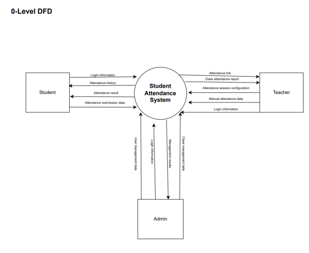
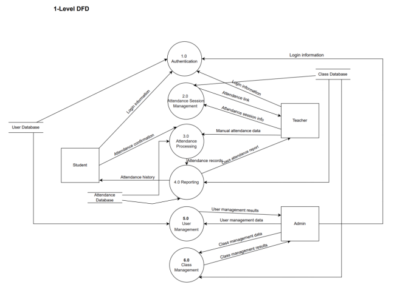
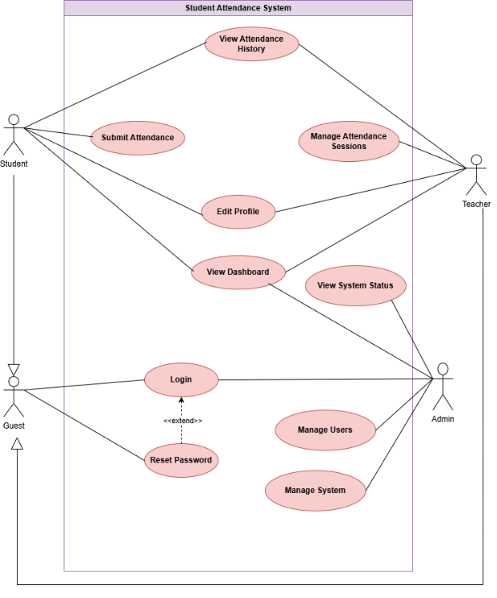
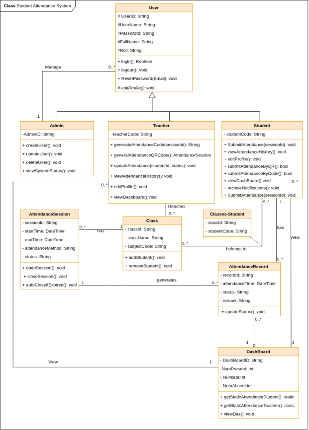
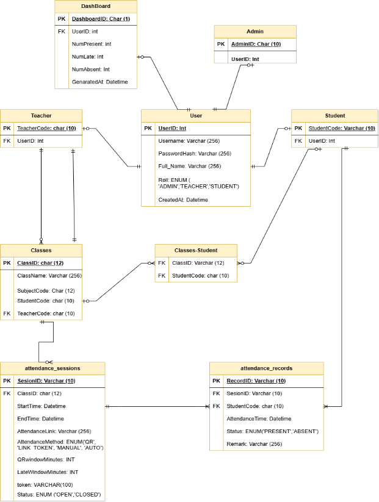

# 📚 Student Attendance System

Hệ thống điểm danh sinh viên trực tuyến - Đồ án môn Công nghệ Phần mềm (Group 14)

---

## 🎯 Mô tả dự án

Hệ thống điểm danh sinh viên trực tuyến cho phép quản lý việc điểm danh trong trường học một cách hiệu quả. Hệ thống hỗ trợ ba loại người dùng: **Admin**, **Teacher** và **Student**, với các chức năng phù hợp cho từng vai trò.

---

## ✨ Các chức năng chính

### 🔐 1. Xác thực người dùng (Authentication)
- Đăng nhập với tài khoản được Admin cung cấp
- Khôi phục mật khẩu qua email
- Phân quyền theo vai trò (Admin/Teacher/Student)

### 📊 2. Dashboard (Bảng điều khiển)
| Vai trò | Thông tin hiển thị |
|---------|-------------------|
| **Student** | Tỷ lệ điểm danh, tổng số giờ học, số buổi vắng, lịch học, lịch sử điểm danh |
| **Teacher** | Các lớp được phân công, tổng số sinh viên, tỷ lệ điểm danh trung bình, lịch dạy |
| **Admin** | Tình trạng hệ thống, hiệu suất, thống kê hoạt động, cảnh báo bảo mật |

### 📝 3. Quản lý phiên điểm danh (Teacher)
- Tạo phiên điểm danh mới với mã lớp, thời gian bắt đầu/kết thúc
- Cấu hình phương thức điểm danh
- Tự động đóng phiên khi hết thời gian

### ✅ 4. Phương thức điểm danh
| Phương thức | Mô tả |
|-------------|-------|
| **QR Code** | Mã QR tự động đổi mỗi 30 giây |
| **LINK_TOKEN** | Mã token có hiệu lực trong thời gian quy định |
| **MANUAL** | Điểm danh thủ công bởi giáo viên |
| **AUTO** | Điểm danh tự động |

### 📋 5. Submit Attendance (Student)
- Điểm danh trong khung thời gian cho phép
- Tự động đánh dấu trạng thái: **Present** / **Absent**

### 📈 6. Xem lịch sử điểm danh
- Sắp xếp theo ngày/giờ hoặc mã lớp
- Tìm kiếm theo mã lớp hoặc ngày điểm danh
- Lọc theo lớp và ngày

### 👥 7. Quản lý người dùng (Admin)
- Tạo, sửa, xóa tài khoản người dùng
- Phân quyền vai trò

### 🏫 8. Quản lý lớp học (Admin)
- Tạo, cập nhật, xóa lớp học
- Gán giáo viên phụ trách
- Quản lý danh sách sinh viên

### 📊 9. Xem báo cáo hệ thống (Admin)
- Báo cáo điểm danh tháng
- Đánh giá hiệu suất khoa
- Phân tích tỷ lệ giữ chân sinh viên
- Kiểm tra bảo mật & truy cập
- Xuất báo cáo: PDF, XLSX, CSV

---

## 🏛️ Kiến trúc hệ thống

### 📊 Data Flow Diagram (DFD)

#### 0-Level DFD (Context Diagram)



**External Entities & Data Flows:**

| Actor | Input → System | System → Output |
|-------|----------------|-----------------|
| **Student** | Login info, Attendance submission data | Attendance history, Attendance result |
| **Teacher** | Login info, Attendance session config, Manual attendance data | Attendance link, Class attendance report |
| **Admin** | Login info, User/Class management data | Management results |

#### 1-Level DFD



**6 Processes chính:**

| Process | Mô tả | Input/Output |
|---------|-------|--------------|
| **1.0 Authentication** | Xác thực người dùng | Login info ↔ User Database |
| **2.0 Attendance Session Management** | Quản lý phiên điểm danh | Session config → Attendance link |
| **3.0 Attendance Processing** | Xử lý điểm danh | Submission → Attendance records |
| **4.0 Reporting** | Báo cáo điểm danh | Records → Reports |
| **5.0 User Management** | Quản lý người dùng (Admin) | User data ↔ User Database |
| **6.0 Class Management** | Quản lý lớp học (Admin) | Class data ↔ Class Database |

---

### 📋 Use Case Diagram



#### Danh sách Use Cases

| Use Case | Student | Teacher | Admin | Guest |
|----------|:-------:|:-------:|:-----:|:-----:|
| Login | ✓ | ✓ | ✓ | ✓ |
| Reset Password | ✓ | ✓ | ✓ | ✓ (extends Login) |
| View Dashboard | ✓ | ✓ | ✓ | |
| Edit Profile | ✓ | ✓ | | |
| Submit Attendance | ✓ | | | |
| View Attendance History | ✓ | ✓ | | |
| Manage Attendance Sessions | | ✓ | | |
| View System Status | | | ✓ | |
| Manage Users | | | ✓ | |
| Manage System | | | ✓ | |

---

### 🏗️ Class Diagram



#### Class Hierarchy

```
                    ┌─────────────┐
                    │    User     │
                    │─────────────│
                    │ UserID      │
                    │ UserName    │
                    │ Password    │
                    │ FullName    │
                    │ Roll        │
                    └──────┬──────┘
                           │
          ┌────────────────┼────────────────┐
          ▼                ▼                ▼
   ┌──────────┐     ┌──────────┐     ┌──────────┐
   │  Admin   │     │ Teacher  │     │ Student  │
   └──────────┘     └──────────┘     └──────────┘
```

#### Classes & Methods

| Class | Attributes | Key Methods |
|-------|------------|-------------|
| **User** | UserID, UserName, Password, FullName, Roll | login(), logout(), ResetPassword(), editProfile() |
| **Admin** | AdminID | createUser(), updateUser(), deleteUser(), viewSystemStatus() |
| **Teacher** | teacherCode | generateAttendanceCode(), generateAttendanceQRCode(), updateAttendance(), viewAttendanceHistory() |
| **Student** | studentCode | SubmitAttendance(), viewAttendanceHistory(), submitAttendanceByQR(), submitAttendanceByCode() |
| **AttendanceSession** | sessionId, startTime, endTime, attendanceMethod, status | openSession(), closeSession(), autoCloseIfExpired() |
| **Class** | classId, className, subjectCode | addStudent(), removeStudent() |
| **AttendanceRecord** | recordId, attendanceTime, status, remark | updateStatus() |
| **DashBoard** | DashBoardID, NumPresent, NumLate, NumAbsent | getStaticAttendanceStudent(), getStaticAttendanceTeacher() |

---

### 🗄️ Data Model (Database Schema)



#### Database Tables

| Table | Primary Key | Description |
|-------|-------------|-------------|
| **User** | UserID (Int) | Thông tin người dùng chung |
| **Admin** | AdminID: Char(10) | Thông tin admin (FK: UserID) |
| **Teacher** | TeacherCode: Char(10) | Thông tin giáo viên (FK: UserID) |
| **Student** | StudentCode: Varchar(10) | Thông tin sinh viên (FK: UserID) |
| **Classes** | ClassID: Char(12) | Thông tin lớp học |
| **Classes-Student** | ClassID + StudentCode | Bảng liên kết sinh viên-lớp |
| **attendance_sessions** | SessionID: Varchar(10) | Phiên điểm danh |
| **attendance_records** | RecordID: Varchar(10) | Bản ghi điểm danh |
| **DashBoard** | DashboardID: Char(1) | Thống kê dashboard |

#### ENUM Values

```sql
-- User Roles
Role: ENUM('ADMIN', 'TEACHER', 'STUDENT')

-- Attendance Methods  
AttendanceMethod: ENUM('QR', 'LINK_TOKEN', 'MANUAL', 'AUTO')

-- Session Status
SessionStatus: ENUM('OPEN', 'CLOSED')

-- Attendance Status
AttendanceStatus: ENUM('PRESENT', 'ABSENT')
```

#### Key Table Details

**attendance_sessions:**
| Field | Type | Description |
|-------|------|-------------|
| SessionID | Varchar(10) | Primary Key |
| ClassID | Char(12) | FK → Classes |
| StartTime | Datetime | Thời gian bắt đầu |
| EndTime | Datetime | Thời gian kết thúc |
| AttendanceLink | Varchar(256) | Link điểm danh |
| AttendanceMethod | ENUM | Phương thức điểm danh |
| QRwindowMinutes | INT | Thời gian hiệu lực QR |
| LateWindowMinutes | INT | Thời gian cho phép trễ |
| token | Varchar(100) | Token điểm danh |
| Status | ENUM | Trạng thái phiên |

**attendance_records:**
| Field | Type | Description |
|-------|------|-------------|
| RecordID | Varchar(10) | Primary Key |
| SessionID | Varchar(10) | FK → attendance_sessions |
| StudentCode | Char(10) | FK → Student |
| AttendanceTime | Datetime | Thời gian điểm danh |
| Status | ENUM | PRESENT / ABSENT |
| Remark | Varchar(256) | Ghi chú |

---

## 👥 Actors (Các vai trò người dùng)

| Vai trò | Mô tả | Chức năng chính |
|---------|-------|-----------------|
| **Guest** | Người dùng truy cập qua link nhưng chưa đăng nhập | Login, Reset Password |
| **Admin** | Quản lý hệ thống, người dùng, lớp học và báo cáo | Manage Users, Manage System, View System Status |
| **Teacher** | Quản lý lớp được phân công, tạo phiên điểm danh | Manage Sessions, View History, Edit Profile |
| **Student** | Điểm danh và xem lịch sử điểm danh cá nhân | Submit Attendance, View History, Edit Profile |

---

## 🛠️ Công nghệ sử dụng

| Thành phần | Công nghệ |
|------------|-----------|
| **Ngôn ngữ** | Python |
| **Cơ sở dữ liệu** | SQLite3 |
| **Giao diện** | Custom Tkinter |

---

## 📦 Danh sách thư viện

### 🖥️ Giao diện người dùng (GUI)
| Thư viện | Mô tả | Cài đặt |
|----------|-------|---------|
| `customtkinter` | Modern UI framework dựa trên Tkinter | `pip install customtkinter` |
| `Pillow` | Xử lý và hiển thị hình ảnh | `pip install Pillow` |
| `tkinter` | GUI framework cơ bản (built-in Python) | Có sẵn |

### 🗄️ Cơ sở dữ liệu
| Thư viện | Mô tả | Cài đặt |
|----------|-------|---------|
| `sqlite3` | SQLite database connector (built-in Python) | Có sẵn |

### 📱 QR Code
| Thư viện | Mô tả | Cài đặt |
|----------|-------|---------|
| `qrcode` | Tạo QR code | `pip install qrcode[pil]` |
| `opencv-python` | Đọc/scan QR code từ camera | `pip install opencv-python` |
| `pyzbar` | Decode QR code/barcode | `pip install pyzbar` |

### 📧 Email
| Thư viện | Mô tả | Cài đặt |
|----------|-------|---------|
| `smtplib` | Gửi email qua SMTP (built-in Python) | Có sẵn |
| `email` | Xây dựng email message (built-in Python) | Có sẵn |

### 🔐 Bảo mật (Security)
| Thư viện | Mô tả | Cài đặt |
|----------|-------|---------|
| `bcrypt` | Hash và verify mật khẩu | `pip install bcrypt` |
| `secrets` | Tạo token ngẫu nhiên an toàn (built-in Python) | Có sẵn |
| `hashlib` | Hash functions (built-in Python) | Có sẵn |

### 📊 Xuất báo cáo
| Thư viện | Mô tả | Cài đặt |
|----------|-------|---------|
| `openpyxl` | Xuất file Excel (.xlsx) | `pip install openpyxl` |
| `reportlab` | Tạo file PDF | `pip install reportlab` |
| `csv` | Xuất file CSV (built-in Python) | Có sẵn |

### 🛠️ Utilities
| Thư viện | Mô tả | Cài đặt |
|----------|-------|---------|
| `datetime` | Xử lý ngày giờ (built-in Python) | Có sẵn |
| `re` | Regular expressions (built-in Python) | Có sẵn |
| `os` | Thao tác hệ thống (built-in Python) | Có sẵn |

### 🧪 Testing
| Thư viện | Mô tả | Cài đặt |
|----------|-------|---------|
| `pytest` | Testing framework | `pip install pytest` |
| `unittest` | Unit testing (built-in Python) | Có sẵn |

---

### 📄 File requirements.txt

```txt
# GUI
customtkinter>=5.2.0
Pillow>=10.0.0

# QR Code
qrcode[pil]>=7.4.0
opencv-python>=4.8.0
pyzbar>=0.1.9

# Security
bcrypt>=4.1.0

# Reports
openpyxl>=3.1.0
reportlab>=4.0.0

# Testing
pytest>=7.4.0
```

---

## 📁 Cấu trúc thư mục

```
Students-Attendance-System-Gr.14/
│
├── 📄 main.py                          # Entry point
├── 📄 requirements.txt                 # Dependencies
├── 📄 README.md                        # Documentation
│
├── 📂 config/                          # Configuration
│   ├── settings.py                     # App settings
│   ├── database.py                     # Database config
│   └── email.py                        # Email config
│
├── 📂 core/                            # Core/Domain Layer
│   ├── 📂 models/                      # Data Models
│   │   ├── user.py                     # User, Admin, Teacher, Student
│   │   ├── classroom.py                # Class model
│   │   ├── attendance_session.py       # AttendanceSession
│   │   └── attendance_record.py        # AttendanceRecord
│   │
│   ├── 📂 enums/                       # Enumerations
│   │   ├── user_role.py                # ADMIN, TEACHER, STUDENT
│   │   ├── attendance_status.py        # PRESENT, ABSENT
│   │   └── attendance_method.py        # QR, LINK_TOKEN, MANUAL, AUTO
│   │
│   └── 📂 exceptions/                  # Custom Exceptions
│
├── 📂 data/                            # Data Access Layer
│   ├── database.py                     # Database connection
│   ├── 📂 repositories/                # Repository classes
│   └── 📂 migrations/                  # Schema & seeds
│
├── 📂 services/                        # Business Logic Layer
│   ├── auth_service.py                 # Authentication
│   ├── attendance_service.py           # Attendance management
│   ├── qr_service.py                   # QR code
│   └── email_service.py                # Email sending
│
├── 📂 controllers/                     # Application Logic
│   ├── auth_controller.py
│   ├── attendance_controller.py
│   └── user_controller.py
│
├── 📂 views/                           # UI Layer (Custom Tkinter)
│   ├── 📂 components/                  # Reusable UI components
│   ├── 📂 layouts/                     # Layout templates
│   └── 📂 pages/                       # Page views by role
│       ├── 📂 auth/
│       ├── 📂 student/
│       ├── 📂 teacher/
│       └── 📂 admin/
│
├── 📂 utils/                           # Utility functions
├── 📂 assets/                          # Static assets
├── 📂 database/                        # SQLite database file
├── 📂 tests/                           # Unit tests
│
└── 📂 docs/                            # Documentation
    ├── 📂 diagrams/                    # System diagrams
    │   ├── dfd_level0.png
    │   ├── dfd_level1.png
    │   ├── usecase_diagram.png
    │   ├── class_diagram.png
    │   └── data_model.png
    └── Requirement Specification & Design Document_Group14.pdf
```

---

## 📋 Yêu cầu phi chức năng

| Tiêu chí | Yêu cầu |
|----------|---------|
| **Usability** | Giao diện responsive, tối đa 3 bước thao tác, ≤9 nút mỗi màn hình |
| **Performance** | Hỗ trợ ~2,000 người dùng đồng thời, phản hồi <3 giây |
| **Scalability** | Lưu trữ dữ liệu 10,000+ sinh viên, 50+ môn học |
| **Security** | Bảo vệ chống SQL Injection, XSS, chống gian lận |
| **Reliability** | Hoạt động 24/7 với uptime ≥99.5% |

---

## 🚀 Hướng dẫn cài đặt

```bash
# Clone repository
git clone <repository-url>
cd Students-Attendance-System-Gr.14

# Cài đặt dependencies
pip install -r requirements.txt

# Khởi tạo database
python -m data.migrations.init_db

# Chạy ứng dụng
python main.py
```

---

## 📄 License

Đồ án môn học Công nghệ Phần mềm - Group 14

---

## 👨‍💻 Nhóm phát triển

**Group 14** - Đại học UTH
